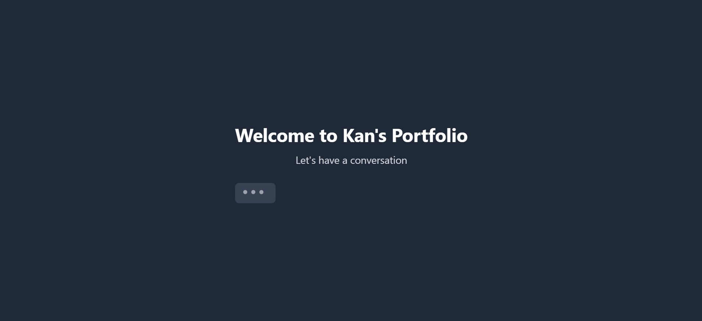
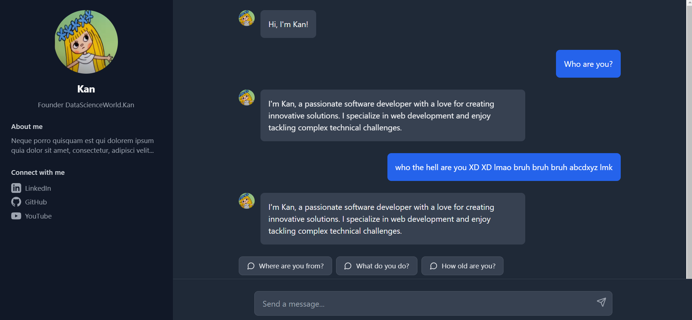

# Interactive Portfolio Chat

A ChatGPT-style portfolio website built with React, TypeScript, and Tailwind CSS. Features include animated message typing, social media links, and an interactive Q&A interface.

## Features

- 💬 ChatGPT-like interface
- ⌨️ Real-time message typing animation
- 🎨 Clean, modern design with Tailwind CSS
- 📱 Fully responsive layout
- 🔗 Social media integration
- 🤖 Smart question suggestion system
- 🔄 Auto-scrolling messages
- 💅 Smooth animations and transitions

## Showcase
### Introduction



### Main UI



### Youtube showcase

[](https://youtu.be/QDOXuIT8mmk)


## Prerequisites

Before you begin, ensure you have installed:
- Node.js (v14.0.0 or higher)
- npm (v6.0.0 or higher)

## Installation

1. Clone the repository:
```bash
git clone https://github.com/khanheric2003/gpt-portfolio
cd gpt-portfolio
```

2. Install dependencies:
```bash
npm install
```

3. Create necessary files:

Create a `chatConfig.ts` file in the `src` directory:
```typescript
export type Topic = 
  | 'introduction' 
  | 'age' 
  | 'location' 
  | 'occupation' 
  | 'goals' 
  | 'favorites' 
  | 'hobbies';

// Add your question patterns, answers, and other configurations
// (See chatConfig.ts in the repository for the full example)
```

4. Add your profile picture:
- Place your profile picture in the `public/assets` directory
- Name it `profile.png`

5. Update social media links:
- Open `App.tsx`
- Replace the placeholder URLs with your actual social media profiles

## Running the Application

1. Start the development server:
```bash
npm run dev
```

2. Open your browser and navigate to:
```
http://localhost:5173
```

## Customization

### Changing the Typing Speed
Adjust the typing animation speed in the `TypeWriter` component:
```typescript
<TypeWriter 
  text={message.content} 
  speed={20} // Lower number = faster typing
/>
```

### Adding New Questions
Update the `chatConfig.ts` file to add new questions and answers:
```typescript
export const questionPatterns: Record<Topic, string[]> = {
  // Add your patterns here
};

export const answers: Record<Topic, string> = {
  // Add your answers here
};
```

### Styling
The project uses Tailwind CSS for styling. You can modify the appearance by:
1. Updating classes in the components
2. Modifying the `tailwind.config.js` file
3. Adding custom styles in the `styles.ts` file

## Project Structure

```
src/
  ├── App.tsx              # Main application component
  ├── chatConfig.ts        # Chat configuration and data
  ├── styles.ts            # Animation and styling
  └── assets/             # Static assets
public/
    └── profile.png     # Your profile picture
```

## Built With

- [React](https://reactjs.org/) - Frontend framework
- [TypeScript](https://www.typescriptlang.org/) - Programming language
- [Tailwind CSS](https://tailwindcss.com/) - CSS framework
- [Vite](https://vitejs.dev/) - Build tool

## Contributing

1. Fork the repository
2. Create your feature branch (`git checkout -b feature/AmazingFeature`)
3. Commit your changes (`git commit -m 'Add some AmazingFeature'`)
4. Push to the branch (`git push origin feature/AmazingFeature`)
5. Open a Pull Request

## License

This project is licensed under the MIT License - see the LICENSE file for details.

## Contact

Khanh Bui - duykhanh.eric@gmail.com

Github Link: [Khanh Bui](https://github.com/khanheric2003)

## Acknowledgments

- Inspired by ChatGPT's interface
- Icons from Lucide React
- Animations inspired by modern web applications